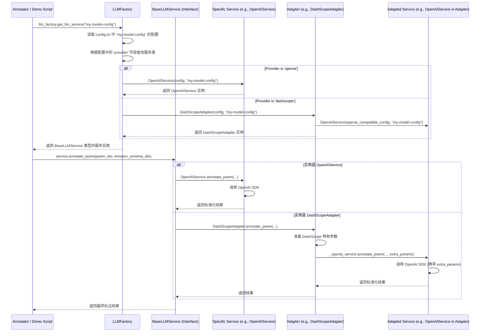

# docs/LLM服务适配器架构设计与实现细节.md

## 1. 架构概览

本项目采用面向接口编程、工厂模式和适配器模式相结合的设计，构建了一个灵活、可扩展的LLM服务调用层。其核心目标是将业务逻辑（如`Annotator`）与具体的LLM实现细节解耦，使得添加新的LLM服务商或API变得简单且对上层透明。

### 1.1. 核心组件

- **`BaseLLMService` (抽象基类)**: 定义了所有LLM服务必须实现的统一接口（如 `annotate_poem`, `health_check`）以及共享功能（如配置加载、提示词构建、日志记录、速率控制）。
- **具体服务实现 (`OpenAIService`, `GeminiService`, `SiliconFlowService`)**: 这些类直接继承 `BaseLLMService`，负责与特定LLM平台（如OpenAI、Google Gemini、SiliconFlow）的SDK或API进行交互。它们封装了平台特有的配置解析、请求构建和响应处理逻辑。
- **适配器 (`DashScopeAdapter`)**: 当一个新平台的API与现有实现（如OpenAI）高度兼容时，可以通过适配器模式快速支持。适配器继承 `BaseLLMService` 以保持接口一致性，并在内部组合一个现有服务实例（如 `OpenAIService`），将平台特有逻辑转换后委托给该实例处理。
- **`LLMFactory` (工厂)**: 核心的实例化和分发中心。它根据配置文件中的 `provider` 字段，动态地创建并返回正确的服务实例。这使得客户端代码（如 `Annotator`）无需关心具体的服务类。
- **`schemas.py` (数据模式)**: 定义了项目中使用的数据传输对象（DTOs），如 `PoemData`, `EmotionSchema`, `AnnotationResult` 以及各种服务配置模式。这提高了代码的类型安全性和可读性。
- **`exceptions.py` (异常体系)**: 定义了LLM服务调用过程中可能遇到的自定义异常层次结构，便于进行精确的错误处理和日志记录。

### 1.2. 交互流程

## 2. 设计原则与模式详解

### 2.1. 面向接口编程 (Interface Segregation & Dependency Inversion)

- **实现**: `BaseLLMService` 作为接口，定义了所有服务的契约。
- **好处**: 
  - `Annotator` 和 `demo/llm_service_demo.py` 等客户端代码只依赖于 `BaseLLMService` 抽象，不依赖于任何具体实现。
  - 易于测试：可以轻松地为 `BaseLLMService` 创建模拟（Mock）对象进行单元测试。
  - 易于替换：切换LLM提供商只需要更改配置，无需修改业务代码。

### 2.2. 工厂模式 (Factory Pattern)

- **实现**: `LLMFactory` 类根据配置动态创建服务实例。
- **好处**:
  - 集中管理对象创建逻辑，避免在业务代码中出现大量的 `if-else` 或 `switch` 来判断和创建对象。
  - 简化客户端使用，客户端只需提供配置名称即可获得服务实例。

### 2.3. 适配器模式 (Adapter Pattern)

- **实现**: `DashScopeAdapter` 继承 `BaseLLMService`，内部聚合了一个 `OpenAIService` 实例。
- **场景**: DashScope API 与 OpenAI API 高度兼容，但有一些额外的、特定的参数（如 `enable_search`）。
- **好处**:
  - **最大化代码复用**: 无需为 DashScope 重新实现一套完整的 OpenAI API 调用逻辑。
  - **轻松扩展**: 未来接入其他兼容 OpenAI 的平台（如 Azure OpenAI, SiliconFlow 的某些模型），只需创建一个新的适配器类，甚至可能通过配置微调 `DashScopeAdapter` 即可。
  - **保持接口一致性**: 对客户端而言，调用 `DashScopeAdapter` 和调用 `OpenAIService` 没有任何区别。

### 2.4. 策略模式 (Strategy Pattern)

- **实现**: `OpenAIService`, `GeminiService`, `SiliconFlowService` 可以看作是 `BaseLLMService` 接口的不同策略实现。
- **好处**: `LLMFactory` 可以在运行时根据配置选择不同的“策略”（即不同的服务实现）来完成任务（调用LLM）。

## 3. 关键实现细节

### 3.1. 配置驱动与初始化

- 每个服务类（包括适配器）的构造函数都接收一个完整的 `config: Dict[str, Any]` 和 `model_config_name: str`。
- 在 `__init__` 方法中，服务类负责解析自己所需的配置项（如 `temperature`, `api_key`, `enable_search` 等），进行类型转换和基本验证。
- `BaseLLMService` 处理通用配置（`api_key`, `model_name`）和通用功能（提示词加载、速率控制初始化）。

### 3.2. 提示词构建与管理 (`prepare_prompts`)

- 该逻辑被提升到 `BaseLLMService` 中，作为一项核心共享能力。
- 它接收 `PoemData` 和 `EmotionSchema` DTO，并返回构建好的 `system_prompt` 和 `user_prompt`。
- 这确保了所有服务在提示词结构上的一致性，同时允许子类通过重写 `_build_system_prompt` 和 `_build_user_prompt` 方法来微调具体内容。

### 3.3. 速率控制与请求延迟

- `BaseLLMService` 提供了 `_ensure_rate_controller` 方法和相关的配置解析逻辑。
- 具体服务在 `annotate_poem` 方法的开头调用 `await self._ensure_rate_controller()` 来确保速率控制器已初始化，并在需要时调用 `await self.rate_controller.acquire()` 来执行速率限制。
- 同样，请求间延迟（`request_delay`）也在 `annotate_poem` 中应用，以满足某些API的特殊要求。

### 3.4. 响应解析与验证 (`validate_response`)

- `BaseLLMService` 提供了统一的 `validate_response` 方法。
- 该方法委托给全局的 `llm_response_parser` 模块，该模块封装了复杂的JSON提取和验证逻辑。
- 所有服务的 `annotate_poem` 方法在获取到LLM的原始文本响应后，都调用 `self.validate_response(response_text)` 来获得一个标准化的、经过验证的Python对象列表。

### 3.5. 日志记录 (`log_request_details`, `log_response_details`, `log_error_details`)

- `BaseLLMService` 提供了标准化的日志记录方法。
- 这些方法处理了敏感信息（如API Key）的掩码，并根据日志级别（INFO, DEBUG）和配置（如 `save_full_response`）来决定记录哪些信息。
- 特别是 `LLMResponseLogger` 被用来将完整的请求/响应/错误信息记录到独立的、结构化的日志文件中，便于调试和审计。

### 3.6. 异常处理

- 引入了 `llm_services/exceptions.py` 来定义清晰的异常层次。
- 具体服务实现会捕获其SDK抛出的原始异常，并根据异常类型或信息转换为项目定义的内部异常（如 `LLMServiceRateLimitError`, `LLMServiceTimeoutError`）。
- 这使得上层调用者（如 `Annotator`）可以基于更语义化的异常类型来执行不同的重试或熔断策略。

## 4. 如何添加新的LLM服务

### 4.1. 添加一个全新的、API不兼容的服务

1. **创建新文件**: 在 `src/llm_services/` 目录下创建 `new_provider_service.py`。
2. **继承基类**: 创建 `NewProviderService` 类，继承 `BaseLLMService`。
3. **实现抽象方法**: 实现 `annotate_poem` 和 `health_check` 方法。
   - 在 `__init__` 中解析该提供商特有的配置。
   - 在 `annotate_poem` 中调用其SDK或API。
   - 在 `health_check` 中实现一个轻量级的健康检查（如ping服务或获取模型列表）。
4. **注册到工厂**: 在 `src/llm_factory.py` 的 `self.providers` 字典中添加映射，例如 `'newprovider': NewProviderService`。
5. **更新配置**: 在 `config/config.ini` 中添加一个新的模型配置段落，`provider` 字段设置为 `newprovider`。

### 4.2. 添加一个与现有服务API兼容的平台（使用适配器）

1. **评估兼容性**: 确认新平台的API与哪个现有服务（如OpenAI）最兼容。
2. **创建适配器文件**: 在 `src/llm_services/` 目录下创建 `new_platform_adapter.py`。
3. **继承基类并组合**: 创建 `NewPlatformAdapter` 类，继承 `BaseLLMService`，并在 `__init__` 中创建一个兼容服务（如 `OpenAIService`）的实例。
4. **处理差异**:
   - 在 `__init__` 中解析新平台特有的配置。
   - 在 `annotate_poem` 中，将特有配置转换为 `extra_params`，然后调用内部服务实例的 `annotate_poem` 方法。
   - 在 `health_check` 中，可以直接委托给内部服务实例。
5. **注册到工厂**: 在 `src/llm_factory.py` 的 `self.providers` 字典中添加映射，例如 `'newplatform': NewPlatformAdapter`。
6. **更新配置**: 在 `config/config.ini` 中添加配置，`provider` 字段设置为 `newplatform`，并包含其特有参数和兼容服务的基础参数。