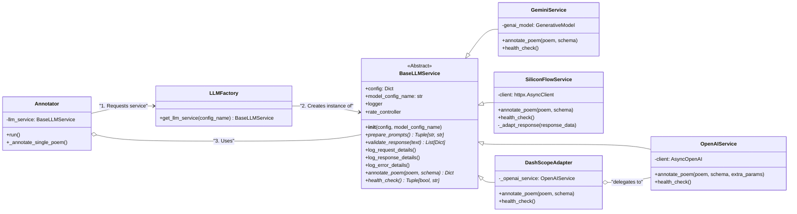

## 🤖 Assistant

好的，我们来基于你提供的现有代码，设计一个清晰、可扩展的适配器层级方案。

### 方案名称：面向多服务商的LLM服务适配器层级设计

---

### 1. 方案目标

设计一个健壮、灵活且易于扩展的软件架构，用于统一处理来自不同LLM（大语言模型）服务商的API调用。该架构旨在将应用程序的核心业务逻辑（如`Annotator`）与具体LLM服务商的实现细节完全解耦，使得：
- **上层调用统一**：业务层代码以统一的方式与任何LLM服务进行交互。
- **底层实现隔离**：每个服务商的API客户端、参数格式、响应结构和错误处理都封装在独立的模块中。
- **轻松扩展**：添加对新服务商的支持变得简单，只需实现一个新的适配器，而无需修改现有业务逻辑。
- **代码复用**：对于API兼容的服务商（如兼容OpenAI API的平台），可以通过适配器模式最大化地复用现有代码。

---

### 2. 核心设计原则

本方案遵循以下几个关键的软件设计原则：

- **面向接口编程 (Programming to an Interface)**：定义一个抽象基类 `BaseLLMService`作为统一的接口协定，所有具体的服务实现都必须遵守此协定。
- **策略模式 (Strategy Pattern)**：将每个LLM服务商的实现视为一个独立的“策略”。`LLMFactory` 在运行时根据配置选择并实例化相应的策略（服务实例），供客户端使用。
- **适配器模式 (Adapter Pattern)**：当某个服务商的API与我们主要的服务模型（如此处的OpenAI API）在接口或参数上略有不同但功能兼容时，使用适配器进行转换，而不是重新实现所有逻辑。`DashScopeAdapter` 是该模式的完美体现。
- **工厂模式 (Factory Pattern)**：使用 `LLMFactory` 来集中管理和创建所有LLM服务实例，隐藏了创建对象的复杂性，并统一了对象的生命周期管理（如熔断器的创建）。
- **依赖倒置原则 (Dependency Inversion Principle)**：高层模块（`Annotator`）不依赖于低层模块（`OpenAIService`, `GeminiService`），两者都依赖于抽象（`BaseLLMService`）。

---

### 3. 适配器层级结构设计

下图清晰地展示了整个适配器层级的结构关系：

**图解说明**:

1. **客户端 (`Annotator`)**：作为API的调用方，它依赖于`LLMFactory`来获取一个遵循`BaseLLMService`接口的服务实例。它完全不知道底层具体是哪个服务商在工作。
2. **工厂 (`LLMFactory`)**：负责根据配置名称，创建并返回一个具体的服务实例。它是连接客户端和具体服务实现的桥梁。
3. **抽象基类 (`BaseLLMService`)**：定义了所有LLM服务必须实现的公共接口（`annotate_poem`, `health_check`）和共享的功能（提示词构建、日志记录、速率限制、响应验证等）。
4. **具体服务实现 (Strategies)**：
 * `OpenAIService`, `GeminiService`, `SiliconFlowService` 是 `BaseLLMService` 的直接子类。它们各自实现了与对应平台交互的全部逻辑，包括初始化SDK、构建特定格式的请求、解析响应等。
5. **适配器 (Adapter)**：
 * `DashScopeAdapter` 同样继承自 `BaseLLMService`，因此对客户端来说它和其他服务是完全一样的。
 * 它的内部持有一个 `OpenAIService` 的实例。当 `annotate_poem` 被调用时，它会准备好DashScope特有的参数，然后将核心的API调用任务**委托**给内部的 `OpenAIService` 实例去完成。这极大地复用了 `OpenAIService` 中已经写好的、与OpenAI兼容的API调用逻辑。

---

### 4. 关键组件职责分析

- **`src/llm_services/base_service.py` (`BaseLLMService`)**
 - **职责**：定义服务契约和提供共享功能。
 - **接口定义**：声明 `annotate_poem` 和 `health_check` 为抽象方法，强制所有子类必须实现。
 - **共享逻辑**：
 - **配置加载**：从 `config` 字典中提取通用配置（api_key, model_name, base_url等）。
 - **提示词管理**：统一加载和构建 `system_prompt` 和 `user_prompt`。
 - **速率控制**：按需初始化速率控制器 (`_ensure_rate_controller`)，供子类在API调用前使用。
 - **日志记录**：提供统一的请求、响应和错误日志记录方法 (`log_request_details`, `log_response_details`, `log_error_details`)，并与 `LLMResponseLogger` 集成。
 - **响应解析与验证**：提供 `validate_response` 方法，利用 `llm_response_parser` 对LLM返回的文本进行统一的解析和结构验证。

- **`src/llm_services/openai_service.py` (`OpenAIService`)**
 - **职责**：实现与OpenAI兼容API（包括官方OpenAI、Azure OpenAI等）的交互。
 - **实现细节**：
 - 解析OpenAI特有的参数（`temperature`, `top_p`, `presence_penalty`等）。
 - 使用 `openai` Python库的 `AsyncOpenAI` 客户端。
 - 在 `annotate_poem` 方法中，将标准输入（prompts）转换为OpenAI `ChatCompletion` API所需的 `messages` 格式。
 - [**重要**] `annotate_poem` 方法增加一个可选的 `extra_params` 参数。这使得它可以被 `DashScopeAdapter` 等适配器复用，用于注入服务商特有的顶层请求参数。

- **`src/llm_services/gemini_service.py` (`GeminiService`)**
 - **职责**：实现与Google Gemini API的交互。
 - **实现细节**：
 - 解析Gemini特有的参数（`top_k`, `candidate_count`, `safety_settings`等）。
 - 使用 `google.generativeai` 官方SDK。
 - 在 `annotate_poem` 方法中，将prompts组合成一个单一的字符串，并调用 `genai_model.generate_content_async`。
 - 处理Gemini特有的响应结构和异常类型。

- **`src/llm_services/dashscope_adapter.py` (`DashScopeAdapter`)**
 - **职责**：适配阿里云百炼（DashScope）的API。
 - **实现细节 (适配器模式)**：
 1. **接口一致性**：继承`BaseLLMService`，实现`annotate_poem`和`health_check`方法。
 2. **组合而非继承**：在 `__init__` 方法中，创建一个 `OpenAIService` 的实例 (`self._openai_service`)。
 3. **参数转换/注入**：在`annotate_poem`方法中：
 - 解析并处理DashScope特有的参数（如 `enable_search`, `result_format`）。
 - 将这些特有参数打包成一个 `extra_params` 字典。
 - 调用 `self._openai_service.annotate_poem()`，并将 `extra_params` 传递进去。
 4. **委托**：健康检查 `health_check` 方法直接调用 `self._openai_service.health_check()`，因为底层的连接测试是相同的。

- **`src/llm_factory.py` (`LLMFactory`)**
 - **职责**：服务的创建和分发中心。
 - **实现细节**：
 - 维护一个 `providers` 字典，将服务商名称（如 'openai', 'gemini', 'dashscope'）映射到对应的服务类。
 - `get_llm_service` 方法根据传入的配置名称，查找对应的 `provider`，从字典中获取正确的类，并用完整的模型配置来实例化它。
 - 统一管理所有模型的熔断器 (`CircuitBreaker`) 实例。

---

### 5. 数据流与交互流程

一次完整的诗词标注流程如下：

1. **启动**：`Annotator` 实例被创建，它调用 `llm_factory.get_llm_service("dashscope-qwen-max")` 请求一个服务实例。
2. **工厂创建**：
 - `LLMFactory` 读取 `config.ini` 中 `dashscope-qwen-max` 的配置。
 - 发现 `provider` 是 `dashscope`。
 - 从 `providers` 字典中查找到 `DashScopeAdapter` 类。
 - 使用配置实例化 `DashScopeAdapter`。在其实例化过程中，它会再创建一个内部的 `OpenAIService` 实例。
 - 工厂返回 `DashScopeAdapter` 实例给 `Annotator`。
3. **标注调用**：
 - `Annotator` 调用 `llm_service.annotate_poem(poem, schema)`。由于 `llm_service` 是 `DashScopeAdapter` 的实例，所以调用的是 `DashScopeAdapter` 的方法。
4. **适配器工作**：
 - `DashScopeAdapter` 的 `annotate_poem` 方法执行。
 - 它构建一个包含 `{"enable_search": true, ...}` 等DashScope特有参数的 `extra_params` 字典。
 - 然后调用其内部 `_openai_service.annotate_poem(poem, schema, extra_params=extra_params)`。
5. **核心服务执行**：
 - `OpenAIService` 的 `annotate_poem` 方法接管。
 - 它调用基类的 `prepare_prompts` 准备提示词。
 - 构建一个标准的OpenAI API请求体。
 - 使用 `request_data.update(extra_params)` 将DashScope的特有参数合并到请求体中。
 - 调用 `log_request_details` 记录请求。
 - 执行速率限制、API调用、响应解析、日志记录等。
6. **返回与验证**：
 - 结果从 `OpenAIService` 返回给 `DashScopeAdapter`。
 - `DashScopeAdapter` 不做额外处理，直接将结果返回给 `Annotator`。
 - `Annotator` 收到最终经过 `BaseLLMService.validate_response` 验证过的、格式统一的标注结果。

---

### 6. 方案优势与扩展性

- **高度解耦**：`Annotator` 无需关心任何服务商的实现细节，切换模型或服务商只需更改配置文件和启动参数。
- **易于扩展**：
 - **添加新服务商**：只需新建一个 `NewProviderService.py` 文件，实现 `BaseLLMService` 接口，然后在 `llm_factory.py` 的 `providers` 字典中注册新类即可。
 - **添加兼容OpenAI的新平台**：如果新平台API与OpenAI兼容但有少量自定义参数，只需创建一个新的适配器类（类似`DashScopeAdapter`），复用`OpenAIService`，开发成本极低。
- **高内聚**：所有与特定服务商相关的逻辑（配置、参数、SDK、错误处理）都封装在其自己的服务类中，职责清晰，便于维护和调试。
- **代码复用**：通过适配器模式和基类共享逻辑，避免了大量重复代码的编写。
