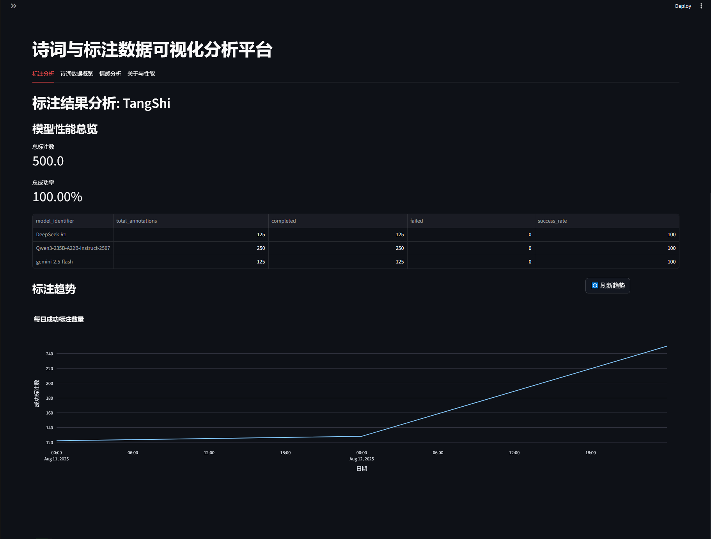
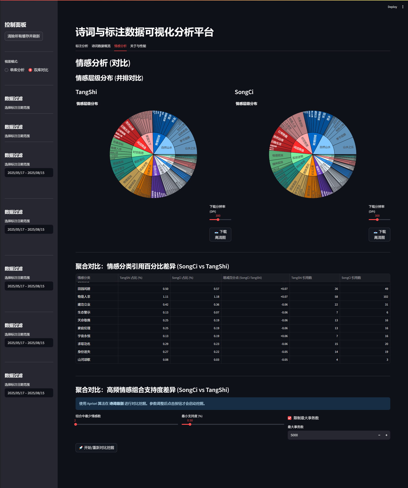
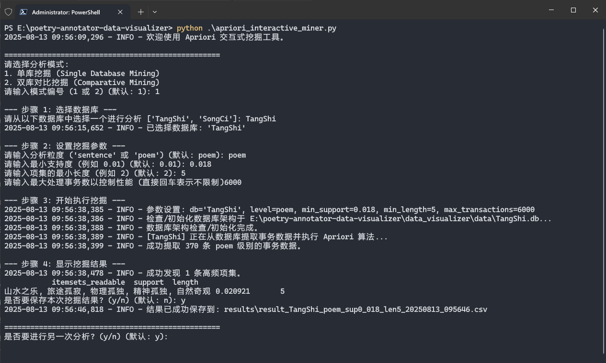

# 诗词与标注数据可视化分析平台

## 项目简介

诗词与标注数据可视化分析平台是一个专门用于分析和可视化古典诗词（如唐诗、宋词）及其AI标注结果的工具。该平台提供了两种交互方式：
1. 基于Streamlit的Web可视化界面
2. 基于终端的交互式Apriori算法挖掘工具

通过这些工具，研究人员可以深入了解诗词的情感分布、模型标注性能、情感共现规律等。

## 界面预览

### Web可视化界面




### 命令行挖掘工具


## 功能特性

### Web可视化界面功能
- **单库分析模式**：深入分析单个诗词数据库
  - 模型性能总览
  - 标注趋势分析
  - 诗人作品数量分布
  - 诗词长度分布
  - 情感类型分析（太阳图、条形图）
  - 情感共现分析（SQL统计和Apriori挖掘）
  
- **双库对比模式**：对比分析两个诗词数据库
  - 模型性能对比
  - 标注趋势对比
  - 诗人作品数量对比
  - 诗词长度分布对比
  - 情感分析对比
  - 高频情感组合支持度差异对比

### 命令行挖掘工具功能
- 交互式设置Apriori算法参数
- 单库情感关联规则挖掘
- 双库情感关联规则对比挖掘
- 挖掘结果导出为CSV文件

## 安装指南

### 环境要求
- Python 3.7 或更高版本
- 支持的操作系统：Windows、Linux、macOS

### 安装步骤

1. 克隆或下载项目代码到本地

2. 安装依赖包：
```bash
pip install -r requirements.txt
```

3. 确保主项目（poetry-annotator）已正确配置，并且数据库文件（如TangShi.db、SongCi.db）位于指定位置

## 使用说明

### 启动Web可视化界面

在项目根目录下运行以下命令启动Streamlit应用：

```bash
streamlit run main.py
```

应用启动后，将在默认浏览器中打开Web界面。

#### 界面功能说明

1. **控制面板**：
   - 切换视图模式（单库分析/双库对比）
   - 选择数据库
   - 设置数据过滤条件（标注日期范围）
   - 清除所有缓存并刷新

2. **标签页**：
   - **标注分析**：查看模型性能和标注趋势
   - **诗词数据概览**：查看诗人作品数量和诗词长度分布
   - **情感分析**：查看情感分布和共现规律
   - **关于与性能**：查看应用优化说明

### 使用命令行挖掘工具

运行以下命令启动交互式Apriori挖掘工具：

```bash
python apriori_interactive_miner.py
```

根据提示选择分析模式和参数设置，工具将执行挖掘并在终端中显示结果。

## 配置说明

### 数据库配置

数据库路径配置在主项目的配置文件中定义，默认使用：
- TangShi.db (唐诗数据库)
- SongCi.db (宋词数据库)

### 缓存配置

为提高性能，应用使用了多级缓存机制：
- **L1 内存缓存** (`@st.cache_data`, `@st.cache_resource`)：Streamlit内置的内存级缓存，速度最快，但在应用重启或会话变更后会失效。
- **L2 磁盘缓存** (`cache.db`)：新增的持久化SQLite数据库缓存。处理后的复杂计算结果（如情感分布DataFrame、Apriori挖掘结果）会被序列化并存储在此独立的数据库文件中。这使得即使在应用重启后，这些耗时计算的结果也能被快速加载，显著提升了冷启动速度和用户体验。

可通过界面按钮或代码清除缓存：
- **“清除所有缓存并刷新”**：清除L1内存缓存和Streamlit会话状态。
- **“🗑️ 清除磁盘缓存”**：清除L2磁盘缓存数据库中的所有条目。

## 性能优化

1. **多级缓存**：引入了基于磁盘的持久化缓存层（`cache.db`），用于存储耗时计算的结果，大幅提升冷启动和首次加载速度。
2. **局部刷新**：多数图表配备独立刷新按钮，只更新对应图表数据
3. **懒加载**：计算密集的Apriori挖掘功能默认关闭，需点击按钮后执行
4. **表格控件**：对大数据表格使用滑块控制显示条目数
5. **状态管理**：通过会话状态管理UI，确保交互连贯性

## 项目结构

```
poetry-annotator-data-visualizer/
├── main.py                 # Web应用入口
├── apriori_interactive_miner.py  # 命令行挖掘工具
├── data_visualizer/        # 可视化核心模块
│   ├── config.py           # 配置文件
│   ├── db_manager.py       # 数据库管理
│   ├── data_processor.py   # 数据处理
│   ├── app/                # Web应用组件
│   │   ├── disk_cache_manager.py  # [新增] 磁盘缓存管理器
│   │   ├── data_fetcher.py        # 数据获取与缓存逻辑
│   │   ├── main_app.py            # 主应用UI与逻辑
│   │   └── ...
│   └── ...
├── cache.db                # [新增] 磁盘缓存数据库文件
├── requirements.txt        # 依赖包列表
├── results/                # 挖掘结果导出目录
├── logs/                   # 日志目录
└── img/                    # 说明图片
```

## 开发指南

### 添加新的可视化图表

1. 在`data_visualizer/app/`目录下创建新的数据获取函数
2. 实现对应的UI组件
3. 在`main_app.py`中添加相应的标签页和调用逻辑

### 扩展挖掘功能

1. 修改`data_processor.py`中的数据处理逻辑
2. 在`apriori_interactive_miner.py`中添加新的参数选项
3. 更新结果展示逻辑

## 常见问题

### 1. 启动Web应用时提示数据库连接失败
请检查主项目的配置文件中数据库路径是否正确，以及数据库文件是否存在。

### 2. Apriori挖掘运行缓慢
可尝试降低最大事务数或提高最小支持度阈值来减少计算量。

### 3. 页面数据未更新
点击侧边栏"清除所有缓存并刷新"按钮强制刷新数据。

## 许可证

本项目仅供学术研究使用。