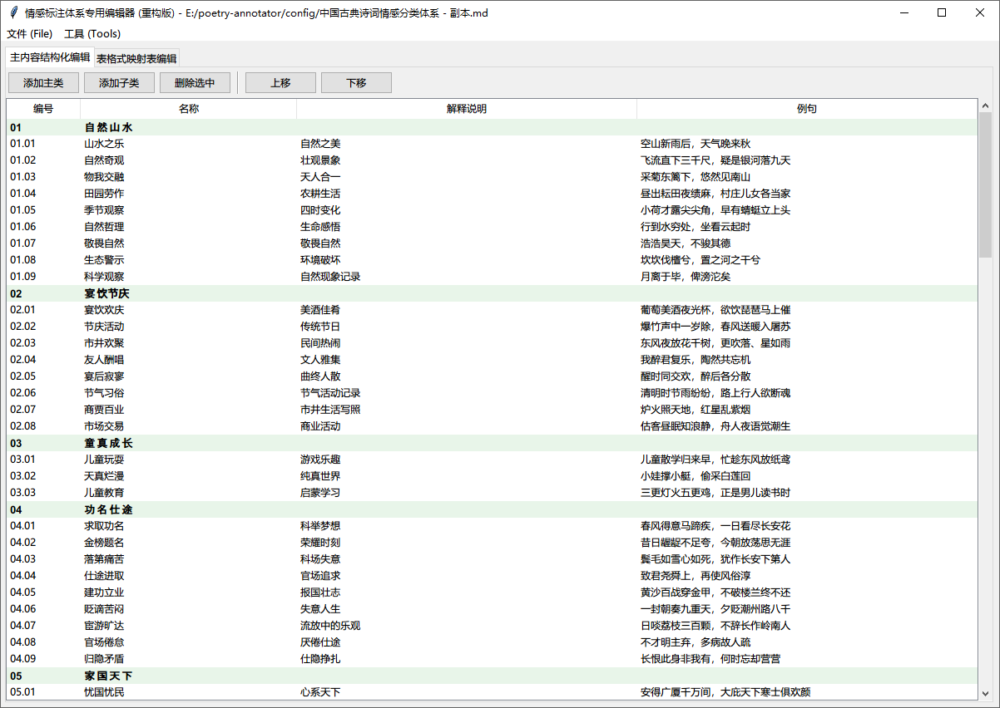
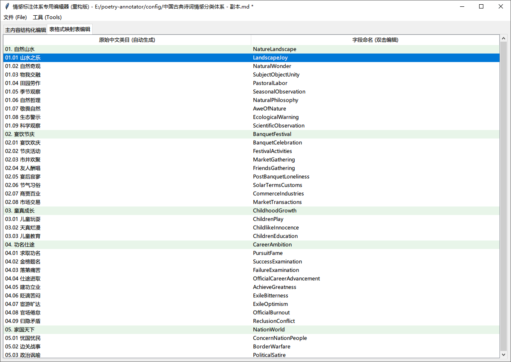

# 诗歌标注编辑器

这是一个专门用于编辑诗歌情感标注体系的图形化工具。它可以帮助用户轻松地创建、编辑和管理诗歌的情感分类体系，并提供中英文类别映射功能。

## 功能特点

- **可视化编辑界面**：基于Tkinter的图形界面，操作直观简单
- **双标签页设计**：
  - 主内容编辑：编辑诗歌情感分类的主体内容
  - 表格式映射表编辑：可视化管理中英文类别映射关系
- **智能解析**：自动识别并解析Markdown格式的情感分类内容
- **格式化工具**：
  - 移除类别编号
  - 移除格式符号
  - 移除例句
  - 一键格式化
- **数据一致性校验**：确保主内容与映射表之间的一致性
- **文件操作**：支持打开、保存和另存为Markdown文件

## 界面预览

### 主界面


### 编辑表单界面


## 安装与运行

1. 确保已安装Python 3.x环境
2. 直接运行主程序：
   ```
   python editor_app.py
   ```

## 使用说明

1. **创建或打开文件**：
   - 使用"文件"菜单中的"打开"选项加载现有的Markdown格式的情感标注文件
   - 或直接在"主内容编辑"区域输入新的内容

2. **编辑主内容**：
   - 按照标准Markdown格式编辑情感分类内容
   - 支持一级类别（#### 标题）和二级类别（- 列表项）

3. **管理映射表**：
   - 切换到"表格式映射表编辑"标签页
   - 系统会自动根据主内容生成映射表
   - 双击"字段命名"列可编辑英文标识符

4. **使用工具**：
   - 通过"工具"菜单或工具栏按钮快速执行文本处理操作

5. **保存文件**：
   - 使用"文件"菜单中的"保存"或"另存为"选项
   - 系统会自动将主内容和映射表合并保存为一个完整的Markdown文件

## 项目结构

- `editor_app.py`：主程序，包含图形界面和用户交互逻辑
- `processing_logic.py`：核心处理逻辑，包括文本解析、格式化和校验功能

## 许可证

本项目为开源软件，可用于任何目的。